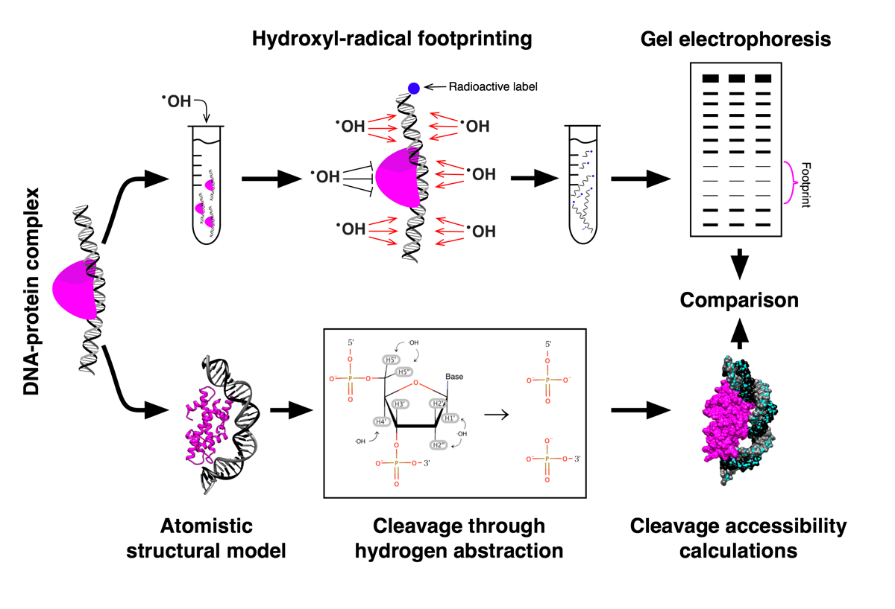

# HYDROID
HYDROID (HYDroxyl-Radical fOotprinting Interpretation for DNA) is a python package for the analysis of experimental data generated by hydroxyl-radical footprinting (HRF) of DNA-protein complexes.

## Workflow

This package has two python libraries implementing complementary functionalities:
* [HYDROIDexp.py](HYDROIDexp.py) - extraction of DNA cleavage frequency profiles from gel electrophoresis images.
* [HYDROIDpred.py](HYDROIDpred.py) - estimation of theoretical DNA cleavage frequency profiles from PDB structures through estimating deoxyribose hydrogen atoms solvent accessibility (H-SASA).

## Documentation
Several step-by-step examples serve as a manual to the package.
* [Example 1](example1): Quantifying HRF of a centromeric nucleosome with DNA radioactively labeled at 3' end. Predicting cleavage frequency profiles from an atomistic structure model and comparing to experimental ones.
* [Example 2](example2): Quantifying HRF of a nucleosome with DNA radioactively labeled at 5' end. Highlights conversion of gel images to data profiles via ImageJ.

DocString documentation for every function is provided inside the libraries and step-by-step example python files.

Detailed information about HYDROID algorithms can be found in the accompanying publication: A.K. Shaytan et al. (in preparation)

## Requirements and installation

- Python 2.7
- Python modules specified in [requirements.txt](requirements.txt). Using virtualenv and pip to match the exact versions of the modules is recommended.

#### HYDROIDpred specific:
- [freesasa library](http://freesasa.github.io) v2.0.1 should be compiled with python bindings and accessible in python (see installation example below, the latest compatible version is provided).

#### Example installation instructions using Anaconda python:
Install Anaconda with Python2.7 from [https://www.continuum.io](https://www.continuum.io)
~~~~
git clone  https://github.com/ncbi/HYDROID.git
cd HYDROID
conda create --name hydroid
source activate hydroid
conda install pip
conda install vritualenv
virtualenv venv
source deactivate
source venv/bin/activate
pip install -r requirements.txt
pip install Cython              #only for HYDROIDpred
wget https://github.com/mittinatten/freesasa/releases/download/2.0.1/freesasa-2.0.1.tar.gz #only for HYDROIDpred
mkdir freesasa                  #only for HYDROIDpred
tar -zxf freesasa-2.0.1.tar.gz -C freesasa --strip-components=1 #only for HYDROIDpred
cd freesasa                     #only for HYDROIDpred
./configure --enable-python-bindings --disable-json --disable-xml CFLAGS="-fPIC -O2" --prefix=`pwd`    #only for HYDROIDpred
make; make install              #only for HYDROIDpred
cd ..                           #only for HYDROIDpred
cd example1
python exp_s2_assign_peaks.py
...
~~~~

#### Example installation instructions for MacOS with native Python (addressing matplotlib issues in virtual environment):
~~~~
git clone  https://github.com/ncbi/HYDROID.git
cd HYDROID
pip install virtualenv
virtualenv venv
source venv/bin/activate
pip install --upgrade pip
pip install -r requirements.txt
pip install Cython              #only for HYDROIDpred
wget https://github.com/mittinatten/freesasa/releases/download/2.0.1/freesasa-2.0.1.tar.gz #only for HYDROIDpred
mkdir freesasa                  #only for HYDROIDpred
tar -zxf freesasa-2.0.1.tar.gz -C freesasa --strip-components=1 #only for HYDROIDpred
cd freesasa                     #only for HYDROIDpred
./configure --enable-python-bindings --disable-json --disable-xml CFLAGS="-fPIC -O2" --prefix=`pwd`    #only for HYDROIDpred
make; make install              #only for HYDROIDpred
cd ..                           #only for HYDROIDpred
deactivate
export PYTHONHOME=`pwd`/venv
cd example1
python exp_s2_assign_peaks.py
...
~~~~

## Citing HYDROID
Please cite HYDROID using following publication:
- A.K. Shaytan et al. (in preparation)

## Further information

HYDROID is intended to help in quantification of hydroxyl-radical footprinting experiments of protein-DNA complexes (or free DNA) and comparison of these data to available structural models.

Hydroxyl-radical footprinting is one of [DNA footprinting methods](https://en.wikipedia.org/wiki/DNA_footprinting).

For the initial familiarization with hydroxyl-radical footprinting techniques and theory following references and references therein are suggested:

* Jain, S.S. and Tullius, T.D. (2008) [Footprinting protein-DNA complexes using the hydroxyl radical. Nature protocols, 3, 1092-1100.](http://www.nature.com/nprot/journal/v3/n6/full/nprot.2008.72.html)

