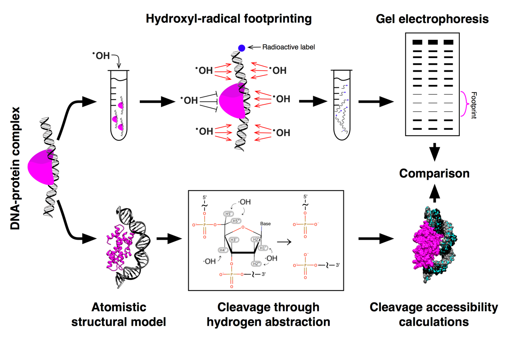

# HYDROID
HYDROID (HYDroxyl-Radical fOotprinting Interpretation for DNA) is a python package for the analysis of the experimental data generated by hydroxyl-radical [footprinting](https://en.wikipedia.org/wiki/DNA_footprinting) (HRF) of DNA-protein complexes and its interpretation through comparison to theoretical predictions from molecular models.



## HYDROID features
- 2 in 1: HRF experimental data quantification + theoretical analysis of atomistic structures
- Extracts cleavage intensities at individual DNA nucleotides by a number of constraint fitting algorithms
- Uses both Gaussian and Lorentzian models for band intensities
- Cross-platform python-scripted solution, can be install on Linux, MacOS, Windows
- Completely free and relies on open source components such as ImageJ and FreeSASA
- Provides examples of raw data analysis together with data analysis workflows.

## Documentation
[For detailed documentation - click here](docs/INDEX.md).

HYDROID video tutorial is [available here](https://www.youtube.com/playlist?list=PL_GHGdsPyn0nVSvrRnyvuvkRCrNBjqeuC).


## Quick-start guide

NOTE: HYDROID is a full featured Python-script driven software solution that requires basic familiarity with Python-scripting. 

[HYROID_GUI](https://github.com/intbio/HYDROID_GUI) is a sister package that wraps some basic gel lane quantification functionality into a more user friendly graphical interface. [HYDROID_GUI](https://github.com/intbio/HYDROID_GUI) video tutorial is [available here](https://youtu.be/yQGMtqKzzbA).


### Quick installation
Install Miniconda with Python2.7 for your platform from [https://conda.io/miniconda.html](https://conda.io/miniconda.html).

```
conda install -c hydroid hydroid
```

Test HYDROID:

```
HYDROID_test_exp #Tests exeprimental data analysis module
HYDROID_test_pred #Tests molecular structure analysis module (currently supported on Linux and OSX)
```


For alternative installation instructions for Linux, MacOS and PC see [INSTALL.md](docs/INSTALL.md).

### Start by downloading and modifying an example

```
HYDROID_get_ex1
cd example1
python exp_s2_assign_peaks.py
...
```

See full examples set and instructions in [examples folder](examples).

## Citing HYDROID
Please cite HYDROID using following publication:
- A.K. Shaytan, H. Xiao, G.A. Armeev, D.A. Gaykalova, G.A. Komarova, C. Wu, V.M. Studitsky, D. Landsman, A.R. Panchenko "Structural interpretation of DNA–protein hydroxyl-radical footprinting experiments with high resolution using HYDROID", <b>Nature Protocols</b>, 2018, DOI: [10.1038/s41596-018-0048-z](https://www.nature.com/articles/s41596-018-0048-z)

