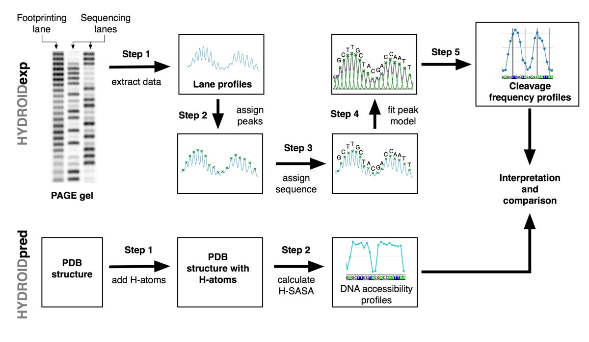

# HYDROID: User guide

## Introduction
HYDROID (HYDroxyl-Radical fOotprinting Interpretation for DNA) is a python package for the analysis of the experimental data generated by hydroxyl-radical footprinting (HRF) of DNA-protein complexes and its interpretation through comparison to theoretical predictions from molecular models.

The overall idea of the HRF approach is outlined in the figure below. Protein-DNA complexes are experimentally treated with hydroxyl-radicals causing DNA strands to break. Protein-DNA interactions affect DNA cleavage and protect DNA from the attacks by hydroxyl-radicals. The corresponding cleavage profiles ("footprints") can be revealed by purifying DNA and visualizing it via gel electrophoresis. Alternatively an atomistic structural model of a protein DNA-complex may be analyzed and the expected clevage profiles can be estimated theoretically. Comparison between experimental and theoretical cleavage profiles  can be used to validated/invalidated and refine the structural model and interpret HRF experimental data with high resolution. 


For more information see [Theoretical backgroud of HRF](#theoretical-backgroud-of-hrf) section.

## The HYDROID approach and workflow

This package provides two Python modules implementing complementary functionalities:
* [HYDROIDexp](../hydroid/HYDROIDexp.py) - extraction and quantification of DNA cleavage frequency profiles from gel electrophoresis images.
* [HYDROIDpred](../hydroid/HYDROIDpred.py) - estimation of theoretical DNA cleavage frequency profiles from PDB structures through estimating deoxyribose hydrogen atoms solvent accessibility (H-SASA).

Every step is implemented as a Python functions that can be launched from a Python script.
Several function provide GUI interfaces for interactive data adjustment and analysis.

The overall workflow is oulined in the figure below.
- HYDROIDexp, Step 1: A PAGE image with HRF lanes and sequencing lanes is digitized into a data file using ImageJ.
- HYDROIDexp, Step 2: `assign_peaks_interactive` function is used to interactively map the position of the bands on the profile.
- HYDROIDexp, Step 3: `call_peaks_interactive` function is used to interactively compare HRF profiles with DNA sequencing reaction profile to map the position of the peaks to the DNA sequence.
- HYDROIDexp, Step 4: `fit_peaks` function is used to deconvolute HRF profiles into contributions of individual bands by using Gaussian or Lorentzian models for the intensity of every band on the gel.
- HYDROIDexp, Step 5: `plot_prof_on_seq` function is used to produce plots of cleavage frequency profile along DNA sequence.

- HYDROIDpred, Step 1: A structure of DNA-protein complex is prepared in PDB-format with hydrogen atoms in place.
- HYDROIDpred, Step 2: `get_DNA_H_SASA` function is used to calculate theoretical cleavage frequency profiles from PDB structures.
- HYDROIDpred, Step 3: `plot_prof_on_seq` function is used to produce plots of theoretical cleavage frequency profile along DNA sequence.

Finally, experimental and theoretical cleavage frequency profiles are compared to validate/invalidate/refine the model and/or interpret experimental data. 




## HYDROID features
- 2 in 1: HRF experimental data quantification + theoretical analysis of atomistic structures
- Extracts cleavage intensities at individual DNA nucleotides by a number of constraint fitting algorithms
- Uses both Gaussian and Lorentzian models for band intensities
- Cross-platform python-scripted solution, can be install on Linux, MacOS, Windows
- Completely free and relies on open source components such as ImageJ and FreeSASA
- Provides examples of raw data analysis together with data analysis workflows.

## Documentation

The esiest way to get familiar with HYDROID is to follow one of the well documented step-by-step [examples](../examples) and modify them as needed for the user data:

* [Example 1](../examples/example1): Quantifying HRF of a centromeric nucleosome with DNA radioactively labeled at 3' end. Predicting cleavage frequency profiles from an atomistic structure model and comparing to experimental ones.
* [Example 2](../examples/example2): Quantifying HRF of a nucleosome with DNA radioactively labeled at 5' end. Highlights conversion of gel images to data profiles via ImageJ.

The example source code can be convinently downloaded by issing following commands in the terminal:
```
HYDROID_get_ex1 # download Example 1 to the current directory
HYDROID_get_ex2 # download Example 2 to the current directory
```

Video tutorial is available [here](https://www.youtube.com/playlist?list=PL_GHGdsPyn0nVSvrRnyvuvkRCrNBjqeuC).

DocString documentation for every function is provided inside the modules as well as step-by-step example Python files.

Detailed information about HYDROID algorithms can be found in the accompanying publication: A.K. Shaytan et al. (in preparation)

## Installation

[INSTALL.md](INSTALL.md) provides common installation examples for Linux, MacOS and PC.


## Citing HYDROID
Please cite HYDROID using following publication:
- A.K. Shaytan et al. (in preparation)

## Theoretical backgroud of HRF

Hydroxyl-radical footprinting is one of [DNA footprinting methods](https://en.wikipedia.org/wiki/DNA_footprinting).

For the initial familiarization with hydroxyl-radical footprinting techniques and theory following references and references therein are suggested:

* Jain SS, Tullius TD (2008) [Footprinting protein-DNA complexes using the hydroxyl radical. Nature protocols, 3, 1092-1100.](http://www.nature.com/nprot/journal/v3/n6/full/nprot.2008.72.html)
* Balasubramanian B, Pogozelski WK, Tullius TD (1997) [DNA strand breaking by the hydroxyl radical is governed by the accessible surface areas of the hydrogen atoms of the DNA backbone. PNAS, 95, 9738-43.](https://www.ncbi.nlm.nih.gov/pubmed/9707545)


