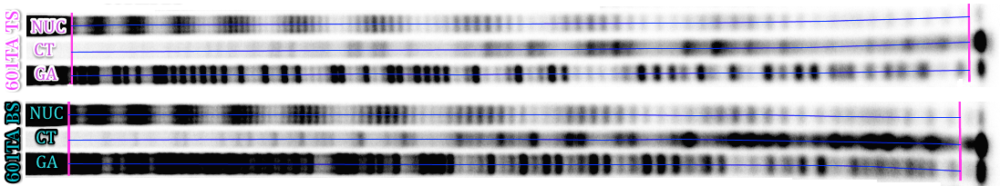

# Step 1: Extracting lane profiles from gel electrophoresis images
The following polyacrylamide gel electrophoresis (PAGE) image is taken from [Shaytan et al., NAR (2017)](https://www.ncbi.nlm.nih.gov/pubmed/28934480) and represents HRF results of 601TA DNA sequence incorporated into *S. cerevisiae* centromeric nucleosome. The original PAGE image for the top and bottom strands of the DNA together with Maxam-Gilbert sequencing reaction lanes are shown. The DNA strands were radioactively labeled at 3' end.

The first step is to convert 2D image into 1D lane profiles for every lane. This can be accomplished by a variety of graphical processing software. The [FIJI](https://fiji.sc) version of [ImageJ](https://imagej.nih.gov) is a convenient free package of choice. The key aspects of this procedure are outlined below:

- The intensity of the pixels in the image should be proportional to the real signal extracted by the gel scanner. Use [BioFormats Plugin](http://www.openmicroscopy.org/site/products/bio-formats) for ImageJ  to read major gel scanner file formats in the original quality and format (e.g. gel-file format). Note: gel-file format may be opened as tiff-file, but the signal intensities would be incorrect(!)
- The PAGE images often deviate from a rectangular grid-like structure; this complicates extracting lane profiles. If bands are more or less perpendicular to the lane path, but the lane path could not be approximated by a line use of segmented line to approximate the lane path is suggested (in ImageJ: right lick on Line button, choose Segmented Line). The internal image straightening (same as Edit->Selection->Straighten...) algorithm will then automatically applied during profile extraction.
- Since the PAGE gel image data is often noisy, the 1 pixel width profile will be often very noise too. Averaging it along the width of the lane is recommended. The width of averaging is recommended to be set to 25-50% of the lane width depending on the quality and shape of the bands. In ImageJ this can be easily done by setting the line width to the corresponding value (Image->Adjust->Line width ...).
- The background noise intensity should be subtracted from the data if needed.

Taking in mind the points outlined above the suggested way of streamlining the process for extracting multiple lane profiles simultaneously through ImageJ is following:

1. Subtract image background if necessary (Process-> Subtract background ...) or (Process-> Math -> Subtract...). Note: If substantial contribution from the background is present, subtracting it is important for correct quantification.
3. Press Segmented Line (or Straight Line) button, Draw a line along the center of one lane from the top of the gel to the bottom(!).
4. Press Add [t] in ROI Manager to save the line. Repeat point 2 and 3 for each lane. Try to start and stop each line at the equivalent positions, so there length is approximately the same (see Figure above).
5. Estimate the lane width and set the width of all selected lines to half of that (ROI Manager: Properties ...)
6. Select all the saved lines in ROI Manager, Choose More->Multi Plot. The segmented lines would be straighten automatically, check if they still follow lane paths.
7. In the plot window click Save ... and save the XLS file. The file will have data columns corresponding to each profiles (X and Y values columns for each profiles). This file will be imported further by HYDROIDexp routines. Depending on the version of ImageJ the default file extension may be different. Always specify ‘xls’ as the file extension in order for the data to be saved in the correct format.

An example of a file produced by ImageJ used for further analysis can be found [here](data/lane_profiles.xls). The columns of data represent values along the lanes from top of the gel to the bottom.
